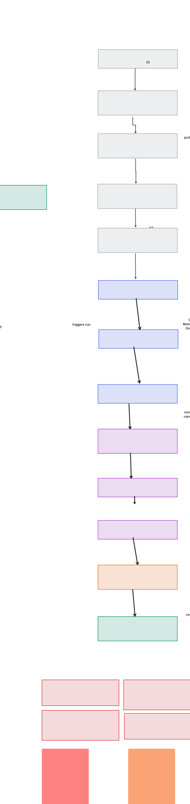

# Atlas_OPS

Personal, single-user job-matching tool. Given a resume and a set of
preferences, it finds, filters, ranks, and emails only jobs that are a
**genuine fit** — with strict seniority/experience filtering (the author is a
fresher).

Optimised for **precision and accuracy**, not scale or latency.

> Status: under active rework. The legacy FastAPI prototype has been retired;
> the tool is now a CLI + scheduled pipeline under `atlas/`. See the phased
> plan below.

## Goal / success metrics

- **Precision@10 >= 80%** — of the top 10 jobs emailed, at least 8 are
  applications worth making.
- **Seniority false-positive rate ~= 0%** — no role requiring more experience
  than the candidate qualifies for gets through.
- Every emailed job carries a reason it matched; every rejected job logs a
  rejection reason.

## Architecture (target)



```
Resume/description -> Profile Agent -> profile.json (human-approved once)
                    -> Query Planner -> Collectors -> Normalize + Dedupe (SQLite)
                    -> JD Parser (regex + LLM) -> Hard Filter (code)
                    -> Skill Match -> Evaluator (LLM) -> Verifier (adversarial)
                    -> Decision Engine -> Ranker -> Digest + Email -> Feedback
```

Design rules:

1. Hard constraints first (deterministic code), soft scoring second (LLM).
2. Structured everything — every LLM output is a validated typed object.
3. LLM understands and judges; code makes the final decisions.
4. Generator and verifier are separate passes.
5. Every job is explainable — why it passed or failed at each stage.
6. Measured against a labelled golden set before/after every change.
7. Human stays in the loop for applying (no auto-submit during the rework).

## Phased roadmap

- **Phase 0** — audit + repo hygiene + config/logging skeleton. *(done)*
- **Phase 1** — Pydantic schemas, LLM client, config, SQLite, input modes. *(done)*
- **Phase 2** — structured JD parsing + hard filters + golden set. *(done)*
- **Phase 3** — skill ontology / alias map + weighted matching. *(done)*
- **Phase 4** — collectors, query planner, normalize, dedupe. *(done)*
- **Phase 5** — evaluator + adversarial verifier. *(done)*
- **Phase 6** — ranker, digest, email, scheduling. *(done)*
- **Phase 7** — feedback loop + tuning. *(done)*
- **Decision Engine** — explicit `apply`/`review`/`skip` with vetoes, confidence,
  and a full audit trail (`atlas/decision.py`, `atlas.cli decide/explain`). *(done)*
- **Phase 8 (deferred)** — tailoring / assisted applying. Blocked until the
  pre-Phase-8 audit gates pass (`python -m atlas.cli selfcheck --full`).

## Setup

```bash
python -m venv .venv
.venv\Scripts\activate            # Windows
pip install -r requirements.txt
cp .env.example .env              # fill in real values, never commit .env
```

### Environment (`.env`)

| Variable | Purpose |
|---|---|
| `GROQ_API_KEY` | Groq LLM API key |
| `ADZUNA_APP_ID` / `ADZUNA_APP_KEY` | Adzuna job API (planned) |
| `RESEND_API_KEY` | Resend email API key |
| `RESEND_FROM_EMAIL` | From address for digests |
| `RESEND_TO_EMAIL` | Digest recipient |
| `ATLAS_DB` | Optional path to the SQLite DB (default `atlas.sqlite3`) |

### Configuration

Preferences live in `config.yaml` (single source of truth). See the file for
all keys.

## Project layout

```
atlas/            # pipeline package (incl. atlas/collectors/)
config.yaml       # user preferences
companies.yaml    # target company ATS board tokens
skills.yaml       # skill ontology / alias map
prompts/          # versioned prompt files
eval/             # golden set + eval harness
tests/            # unit tests
auto_applications/# legacy Playwright bots, retained for Phase 8 (disabled)
```

## Sources (Phase 4)

Collectors are pluggable (`atlas/collectors/`) and enabled per-source in
`config.yaml` under `sources:`. Failures in one source never abort the run.

| Source | Type | Needs |
|---|---|---|
| RemoteOK | feed | — |
| Remotive | feed | — |
| Adzuna | API | `ADZUNA_APP_ID`, `ADZUNA_APP_KEY` |
| Greenhouse | ATS board | token in `companies.yaml` |
| Lever | ATS board | token in `companies.yaml` |
| Ashby | ATS board | token in `companies.yaml` |

Jobs are stripped of HTML/boilerplate, given a stable dedupe key, merged across
boards, freshness-filtered, and stored in SQLite. Per-source and per-query yield
is printed (and recorded in the `runs` summary).

## Pipeline (Phase 5)

`atlas/pipeline.py` is an explicit state machine — not a free-roaming agent loop:

```
parse (regex + LLM) -> hard filter (code) -> skill match -> evaluator (LLM)
   -> verifier (adversarial, different model) -> ranker (weighted score)
```

- **Evaluator** (`atlas/evaluator.py`, `prompts/evaluator.md`) scores each
  surviving job against the profile, cites evidence, and recommends
  `strong_apply|apply|maybe|skip`. Results are hash-cached so a job never costs
  a second call.
- **Verifier** (`atlas/verifier.py`, `prompts/verifier.md`) argues *against*
  applying and can **veto** or **downgrade** (never raise). It runs on a
  different model from the evaluator for independence.
- **Ranker** (`atlas/ranker.py`) computes a weighted final score from
  `config.yaml: ranking.weights` (fit, must-have coverage, seniority fit,
  preference bonus).
- Low-confidence parses are flagged for human review; jobs whose must-have
  coverage is below `filters.must_have_coverage_floor` cannot exceed `maybe`.

Every stage logs its inputs/outputs via `log_stage` (`parsed_jds`,
`filter_results`, `evaluations`, `verifications`), so any decision is traceable.

## Decision engine

`atlas/decision.py` turns a verified evaluation into an explicit
**`apply` / `review` / `skip`** outcome with a fully auditable record. It reuses
the evaluator `Verdict` (role/growth/seniority fit) and the adversarial verifier
veto/downgrade, and adds only two LLM judgements: **`project_relevance`**
(are the candidate's projects relevant to this JD?) and an adversarial
**`decision_critic`** (argue against applying).

- **Pure dimensions** — `skills_core`, `skills_secondary`, `education_fit`,
  `logistics_fit`, `project_relevance`, `role_fit`, `growth_fit`,
  `seniority_fit` — weighted per `config.yaml: decision.weights` (must sum to
  1.0), with a bounded red-flag penalty.
- **Hard vetoes** (force `skip`): must-have coverage below
  `decision.coverage_floor`, insufficient years (with `EXPERIENCE_TOLERANCE_YEARS`
  = 1y), `seniority_fit` below `decision.seniority_floor`, a verifier veto, or a
  critic veto. Soft vetoes (e.g. a verifier downgrade) force `review` instead.
- **Deterministic rule** — `hard veto -> skip`; `soft veto or confidence <
  decision.c_min -> review`; `score >= decision.apply and confidence >=
  decision.c_apply -> apply`; `score >= decision.review -> review`; else `skip`.
  Confidence blends parse quality, sample spread, evaluator/verifier agreement,
  evidence validity, and margin over the apply threshold.
- **Audit trail** — each `Decision` stores dimension scores, weights, spreads,
  vetoes with verbatim evidence, `config_hash`, prompt versions, and model
  names; it is persisted in the `decisions` table. All LLM evidence quotes are
  validated verbatim against the JD/profile (see `atlas/evidence.py`).

Every stage logs its inputs/outputs via `log_stage` (`parsed_jds`,
`filter_results`, `evaluations`, `verifications`, `decisions`).

## Digest, email, scheduling (Phase 6)

- **Digest** (`atlas/digest.py`) — one digest per run, grouped into **Strong
  matches**, **Worth a look**, and **Needs review** (low-confidence parse). Each
  item shows title, company, location, link, fit score, up to 3 reasons for, the
  main risk, missing skills, and the seniority assessment. It also carries the
  funnel summary: processed → filtered out (with per-rule rejection counts) →
  evaluated → sent.
- **Email** (`atlas/emailer.py`) — sent via the [Resend](https://resend.com) API.
  Requires `RESEND_API_KEY`, `RESEND_FROM_EMAIL`, `RESEND_TO_EMAIL`. If not
  configured, the digest is printed to the console and nothing is sent.
- **Idempotency** — every emailed job is stamped in `jobs.emailed_at`; a job is
  never emailed twice. Re-running is safe and prints “no new matches”.
- **Scheduling** (`atlas/scheduler.py`) — `atlas schedule` runs once immediately
  then daily at `schedule.daily_hour` (default 09:00 local). For unattended
  operation, prefer Windows Task Scheduler, cron/systemd, or GitHub Actions.
  Sending nothing when nothing clears the bar is a valid, expected outcome.

## Feedback loop (Phase 7)

Record a judgement for any job and the pipeline adapts on the next run:

```bash
python -m atlas.cli feedback <job_id> good
python -m atlas.cli feedback <job_id> bad --reason too_senior
python -m atlas.cli feedback --export        # append labelled cases to eval/feedback.jsonl
```

Reason codes: `too_senior`, `wrong_stack`, `bad_company`, `wrong_location`,
`other`, `good_fit`. Feedback is stored in SQLite and folded back in as
**bounded** tuning (`atlas/feedback.py`): bad companies are blacklisted, good
companies get a rank bonus, and weights are nudged then renormalised (e.g. a
`wrong_stack` dislike raises must-have-coverage weight). `--export` grows the
labelled eval set, and `atlas eval` records a pass/fail history in the DB so
accuracy can be tracked over time.

## CLI

```bash
python -m atlas.cli profile --resume resume.pdf --describe "target roles..." --out profile.json
python -m atlas.cli review profile.json     # review + approve
python -m atlas.cli status
python -m atlas.cli collect                   # fetch + normalize + dedupe (Phase 4)
python -m atlas.cli run                       # parse -> filter -> evaluate -> verify -> rank -> email
python -m atlas.cli run --collect --limit 50  # fetch first, then process
python -m atlas.cli run --no-email            # build + print the digest only
python -m atlas.cli decide                    # default: decision engine dry-run (no email)
python -m atlas.cli decide --limit 25         # dry-run decision engine over <=25 jobs
python -m atlas.cli explain <job_id>          # show the latest stored decision for a job
python -m atlas.cli schedule --hour 9         # run now, then daily at 09:00
python -m atlas.cli eval                     # golden-set evaluation (deterministic)
python -m atlas.cli eval --with-llm          # + live LLM precision@10 gate
python -m atlas.cli feedback <job_id> good|bad --reason <code>
python -m atlas.cli selfcheck --fast          # deterministic pre-flight checks
python -m atlas.cli selfcheck --full          # + coverage/lint/type/mutation
```

## Testing

```bash
pip install -r requirements-dev.txt
python -m pytest                             # unit tests (year regex, filters, parser, LLM, DB)
python -m atlas.cli selfcheck --fast         # repo/pipeline pre-flight checks
python eval/eval.py                          # standalone golden-set eval
```

`selfcheck` runs the pre-Phase-8 audit checks (hygiene, secrets, gitignore,
pinned deps, README, tests, coverage, lint/format/types, dead code, network
isolation, pipeline invariants) and exits non-zero if any check is FAIL or
BLOCKED. `--full` adds coverage/lint/type/mutation checks. `--report out.json`
writes the machine-readable result (timestamp, git SHA, config hash, prompt
versions, models).

The golden set lives in `eval/golden_set.jsonl` (one JSON object per line:
`id, title, description, company, location, label, reason, expected_min_years,
expected_seniority`). It is bootstrapped with synthetic cases and should be
expanded with ~40 real labelled JDs.

## Security

- Never commit `.env`, `uploads/`, resumes, or the SQLite DB.
- Rotate any key that was ever committed.
